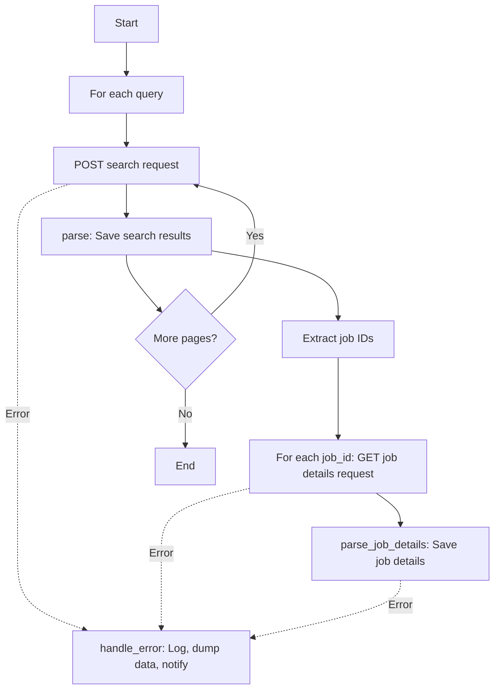

# VDAB Job Scraper with 🕸️ Scrapy 🕸️


## Related Projects
This project is set up in my airflow server with a Docker out of Docker (DooD) setup that runs the scraper daily. Check out **[✨ My Airflow Home Server ✨](https://github.com/GerritGeeraerts/airflow-home-server)** project!


## 🔍 Description
Professional web scraper for extracting job listings from VDAB.be (Flemish Public Employment Service). This Scrapy-based project searches for specific tech-related jobs in Belgium and systematically extracts raw json data from vdab's backed services avoiding decoding the html and giving us json structuredd data which is ideal for our bronze layer.

## 🕸️ Spider Workflow

The following diagram illustrates how the VDAB spider operates:



### Workflow Explanation

1. **🚀 Initialization**: Spider loads configuration including search queries, criteria, and paths
2. **🔍 Search Phase**: For each query, sends POST request to VDAB's search API
3. **📥 Parse Results**: Extracts job IDs from search results and handles pagination
4. **🎯 Detail Scraping**: For each job ID, fetches detailed job information
5. **💾 Data Storage**: Saves all data in structured directory format by date
6. **⚠️ Error Handling**: Comprehensive error tracking with Slack notifications
7. **🔄 Pagination**: Automatically handles multiple pages of search results

## 🔧 Features

🔄 **Request Retry**: Automatic retry mechanisms for failed requests<br>
🔌 **Handle Connection Drops**: Scrapy handles connection drops by pausing the crawler<br>
🔔 **Slack Notifications**: Real-time notifications for critical failures<br>
🥉 **Bronze Layer**: Raw data storage organized by date<br>
🗃️ **Partitioned Storage**: Year/Month/Day folder structure<br>
🐛 **Failure Tracking**: Complete request/response/error data for debugging<br>
🚀 **CI/CD**: Local runner that rebuild docker when the main branch changes.<br>
🚦 **Throttling**: Throttling to respect server load.<br>
🐳 **Containerized**: Created Docker image for running my airflow server<br>

## 📦 Repo structure
```
├── scrapy_vdab/
│   ├── spiders/
│   │   └── vdab.py              # Main spider for job scraping
│   ├── data/
│   │   └── datalake/            # Structured data storage (bronze layer)
│   │       └── projects/jobs/bronze/vdab/
│   │           ├── job_searches/    # Raw search results by date
│   │           ├── job_listings/    # Individual job details
│   │           └── failures/        # Error logs and debugging data
│   ├── assets/
│   │   └── example_failure_dump.json  # Sample failure data structure
│   ├── settings              # Scrapy configuration & spider settings
│   │   ├── base.py           # common settings
│   │   ├── dev.py            # development specific settings
│   │   └── production.py     # production specific settings
│   ├── items.py                 
│   ├── middlewares.py        # handle http errorcodes       
│   ├── pipelines.py             
│   ├── utils.py                 # Utility functions (Slack, error handling)
│   ├── docs-endpoint-detail.md  # API documentation for job details
│   └── docs-endpoint-zoek.md    # API documentation for job search
├── Dockerfile                   # Container configuration
├── requirements.txt             # Python dependencies
└── scrapy.cfg                   # Scrapy project configuration
```
### Job Details Structure
Individual job data stored as:
```
data/datalake/projects/jobs/bronze/vdab/job_listings/
└── year=2024/month=01/day=15/
    ├── 71780743.json           # Complete job posting data
    └── 71829072.json           # Another job posting
```

## 🔍 API Endpoints

The spider interacts with VDAB's REST API:

### Job Search
- **Endpoint**: `POST https://www.vdab.be/rest/vindeenjob/v4/vacatureLight/zoek`
- **Purpose**: Search for jobs matching specific criteria
- **Documentation**: [docs-endpoint-zoek.md](scrapy_vdab/docs-endpoint-zoek.md)

### Job Details  
- **Endpoint**: `GET https://www.vdab.be/rest/vindeenjob/v4/vacatures/{id}`
- **Purpose**: Retrieve complete job posting information
- **Documentation**: [docs-endpoint-detail.md](scrapy_vdab/docs-endpoint-detail.md)

## ⚙️ Advanced Configuration
The project has a multiple settings files for development, and production.

### Slack Notifications
Enable real-time error notifications:
```python
SLACK_NOTIFICATIONS_ENABLED = True
SLACK_WEBHOOK_URL = "https://hooks.slack.com/services/YOUR/WEBHOOK/URL"
SLACK_MAX_NOTIFICATIONS_PER_SPIDER = 10
```

### Throttling & Rate Limiting
Built-in respect for server resources:
```python
DOWNLOAD_DELAY = 0.5
AUTOTHROTTLE_ENABLED = True
CONCURRENT_REQUESTS_PER_DOMAIN = 16
```

### Custom Search Criteria
Modify geographic and timing filters:
```python
VDAB_SEARCH_CRITERIA = {
    "locatieCriteria": {
        "locatieCode": "2643",
        "locatiePostcodeGemeente": "9451 Kerksken", 
        "straalInKilometer": 30
    },
    "onlineSindsCode": "9000",  # All jobs
    "sorteerVeld": "DATUM"
}
```

## 🐛 Debugging & Monitoring

### Failure Analysis
Failed requests generate comprehensive debug files aswell as a notification on slack
```json
{
  "timestamp": "2024-01-15T10:30:00",
  "request": {
    "url": "https://www.vdab.be/rest/...",
    "method": "POST",
    "headers": {...},
    "body": "..."
  },
  "response": {
    "status": 500,
    "headers": {...},
    "body": "..."
  },
  "error": {
    "type": "HTTPError",
    "traceback": "..."
  }
}
```

### Log Levels
Run with different verbosity:
```bash
scrapy crawl vdab -L INFO   # Standard logging
scrapy crawl vdab -L DEBUG  # Verbose debugging
scrapy crawl vdab -L ERROR  # Errors only
```


## 🚀 Getting Started

### 📋 Prerequisites
Before running the spider, ensure you have Python 3.11+ installed.

### 💾 Install requirements
```bash
pip install -r requirements.txt
```

### 🔧 Configuration
You can modify search queries in `scrapy_vdab/settings.py`, I did not scrape all jobs, as this is just a demonstration project. You can add your own keywords here:
```python
VDAB_SEARCH_QUERIES = ["etl", "data engineer", "sql"]
```

### 🏃‍♂️ Run the Spider
Execute the spider to start scraping job listings:

```bash
cd scrapy_vdab
scrapy crawl vdab
```

### 🐳 Docker Deployment
For containerized deployment:

```bash
# Manually create a Docker volume for data persistence
docker volume create datalake

# Build the image
docker build -t scrapy-vdab .

# Run with data persistence
docker run -v datalake:/app/scrapy_vdab/data/datalake scrapy-vdab

# Interactive mode for debugging
docker run -it scrapy-vdab /bin/bash
```

## ⏱️ Timeline
I was able to complete this project in 2 days.

## 🤝 Contributing
Feel free to submit issues and enhancement requests.

### Connect with me!
[](https://www.linkedin.com/in/gerrit-geeraerts-143488141)
[](https://stackoverflow.com/users/10213635/gerrit-geeraerts)
[](https://askubuntu.com/users/1097288/gerrit-geeraerts)